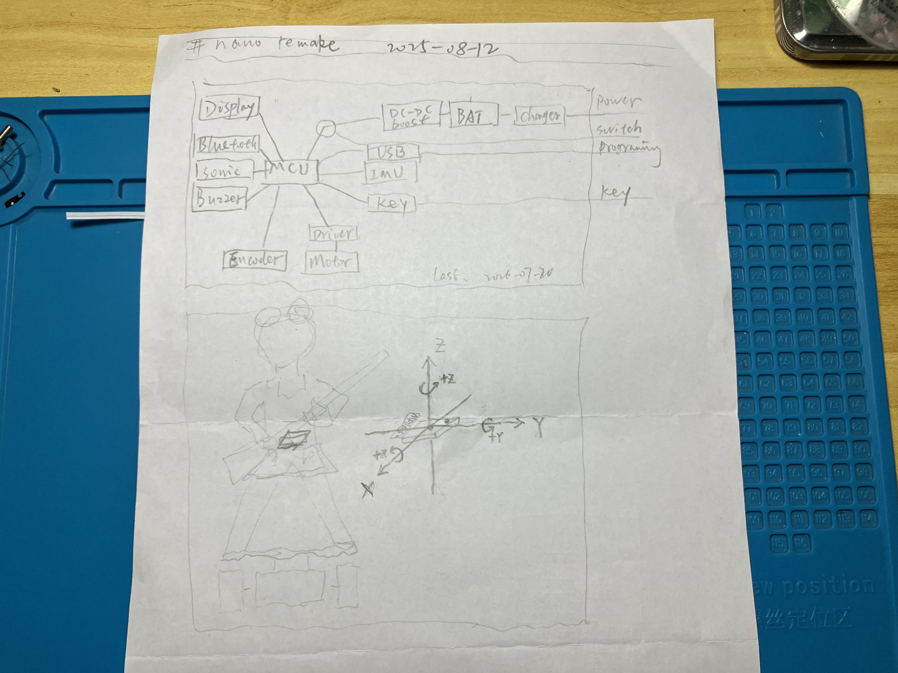
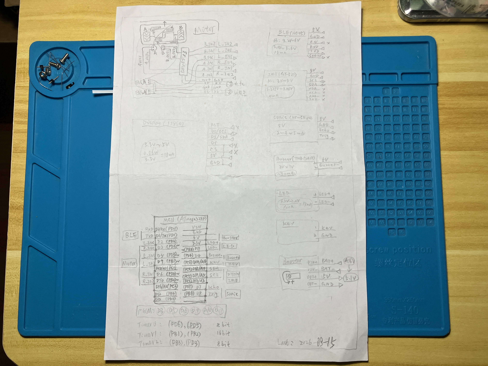
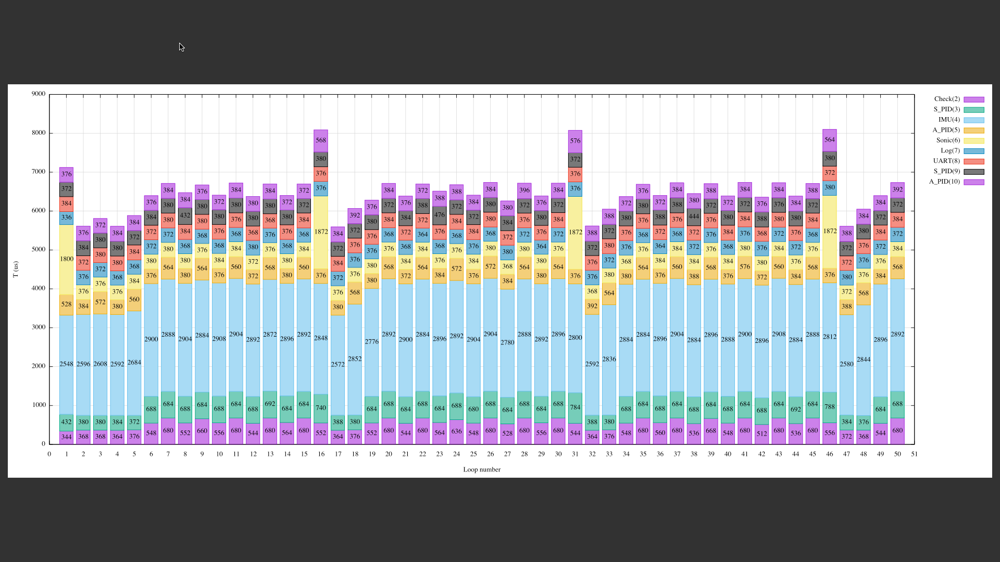
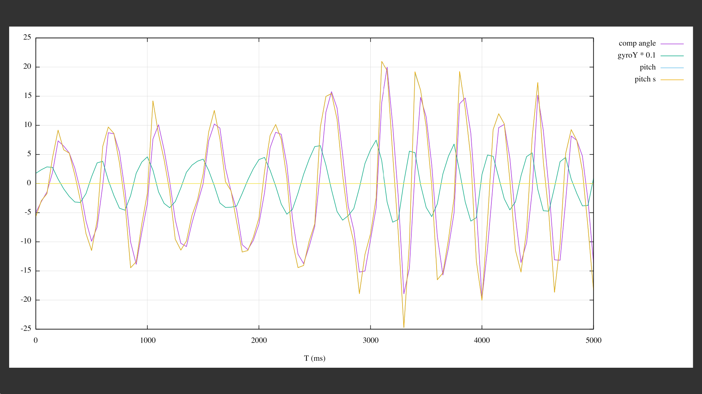
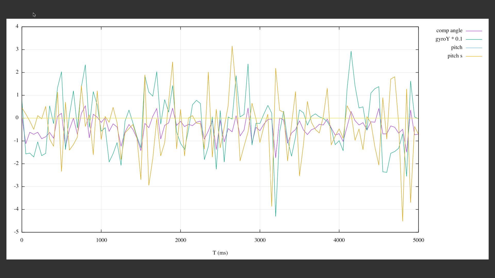
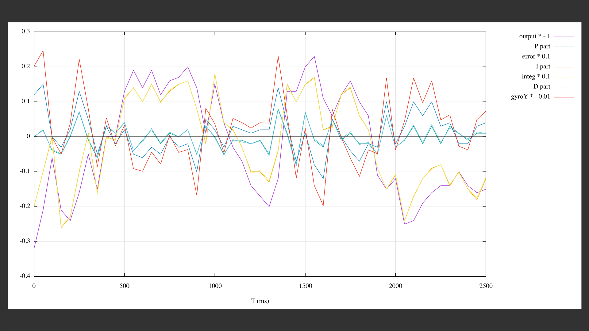
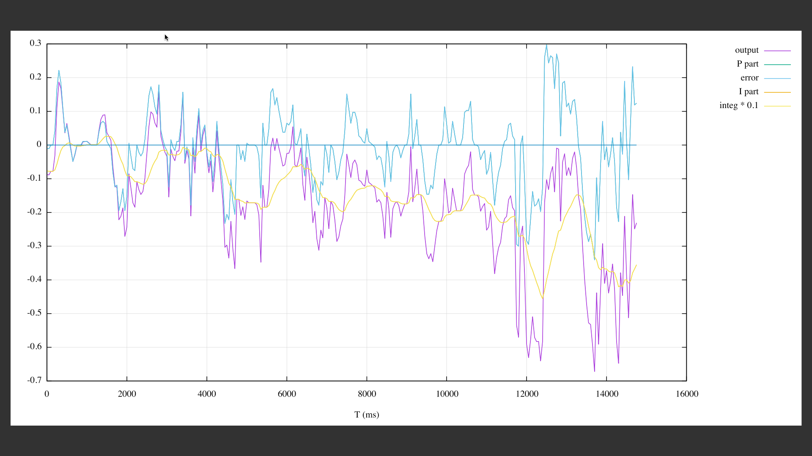

firewheel 哪吒形象二轮自平衡车

原项目: [蛋黄和Nano - 全球最迷你的自平衡机器人 | 技术开发](https://pengzhihui.xyz/2015/12/09/nano/)

# 主要更改

* 去掉摄像头和屏幕
* 引脚有改动
* 每个电机用两个 PWM 引脚

# 操作逻辑

接通电源，进入待机模式

待机模式：

* 短按按钮，响 1 声，等待 2 s，响 2 声，进入平衡模式
* 放置角度与平衡角度误差小于 0.2 度，并且角速度小于 0.5 度/s，响 2 声，进入平衡模式
* 长按按钮，响 2 声，再按一下，进入角度调节模式

平衡模式：

* 按一下按钮，响 3 声，回到待机状态
* 倒地，响 3 声，回到待机状态
* 拿起，超速运行超过 500 ms，响 3 声，回到待机状态

角度调节模式：

* 扭动左轮，大约半圈，响 1 声，平衡角度 -0.1 度
* 扭动右轮，大约半圈，响 1 声，平衡角度 +0.1 度
* 到达零度时，长响 1 声
* 短按按钮，响 2 声，不保存调节，再按一下，进入左轮控制右轮模式
* 长按按钮，长响 1 声，然后响 2 声，保存调节，再按一下，进入左轮控制右轮模式

左轮控制右轮模式：

* 按按钮，响 2 声，再按一下，进入左轮分段模式

左轮分段模式：

* 按按钮，响 2 声，再按一下，进入左轮失重模式

左轮失重模式：

* 按按钮，响 2 声，再按一下，响 4 声，再响一声，进入待机模式

# 框图

# 接线图

# 时序

# 角度数据

电机无输出，手动摇摆：

平衡输出状态：

# 角度环数据

# 速度环数据

# 硬件列表

## 商品

    ---------------------------------------------------------------------
    名称                型号参数                    数量   价格
    -----------------   --------------------------  -----   -------------
    开发板              Arduino nano CH340G,        1       12.9RMB/1个
    屏幕                SPI OLED 0.96 inch 128x64   1       8.6RMB/1个
    惯性测量单元        I2C GY-521 MPU6050          1       14.11RMB/1个
    蓝牙模块            UART HC-05                  1       14.7RMB/1个
    超声波探测器        UART HC-SR04                1       5.31RMB/1个
    锂电池              3.7V 820mAh 653138(二手)    1       4.41RMB/2个
    升压模块            MT3608 DC-DC 2A 可调        1       1.75RMB/个
    电池充电板          TP4056 1A                   1       0.69RMB/个
    减速电机            7 字型 250转 DC 3-5V(二手)  2       0.70RMB/个
    测速码盘            TT电机轮子 20袼 d=25.75     2       0.15RMB/个
    光电开关            ITR9608                     2       0.39RMB/个
    轮子                d=39 w=17.5(二手)           2       0.35RMB/2个
    直流电机驱动模块    DRV8833 红板 2.7-10.8V 1.5A 1       2.1RMB/个
    蜂鸣器              有源 TMB12A05 5V            1       0.47RMB/个
    按键                6x6x5                       1       0.7RMB/20个
    开关                SS-12D07G3 3mm              1       1.5RMB/20个
    ---------------------------------------------------------------------

    合计 70.07RMB

## 材料

* 铝塑板
* 导线
* 焊锡丝
* 热熔胶
* 铁丝
* 金属片
* 透明塑料片
* 绿色纸
* 粉色泡沫
* 蓝色口罩
* 红色撕裂绳
* 竹签

## 工具

* 个人电脑
* 可调电源
* 万用表
* 示波器
* 电烙铁
* 镊子
* 斜口钳
* 数据线
* 热熔胶枪
* 剪刀
* 记号笔
* 铅笔

# Changelog

    * 2025-08-23
        * Add: 拿起检测，放下自动运行
        * Fix: gyro / GYRO_FACTOR 结果是整数
        * Fix: reset_state() 之后惯性导致编码器继续计数
        * Modify: Motor_measure() 复用
    * 2025-08-22
        * Modify: 角度环输出归一化
        * Add: beep_ms() 函数
    * 2025-08-20
        * Modify: 按键，短按，长按，去抖
        * Modify: loop() 是主循环，平衡运动做成一个函数
    * 2025-08-19
        * Add: Motor_control()
    * 2025-08-18
        * Add: Config.ino Config_load(), Config_save()
        * Add: TC 读取配置
        * Add: RR 运行，RS 停止 指令
        * Remove: Sonic() 之后的 angle_PID_compute()
    * 2025-08-12
        * Remove: IMU.ino 多余的 angle_PID_compute()
        * Modify: IMU.ino 中，IIC 错误后设置摔倒标志位，而不是无限循环
        * Modify: IMU 返回的数据用 int16_t
        * Modify: Timer1 频率改成 976 Hz
        * Fix: 中断函数编码器计数周期太大，周期性丢失计数
        * Modify: 速度改成归一化
        * Fix: PID 函数中的日志输出造成影响，放到平衡循环减小执行频率
        * Add: now 变量，判断间隔之后立即设置现在的时间
        * Modify: i2c 函数优化，去除超时判断
        * Modify: setup 中 IMU 不再读取温度
        * Modify: setup 中 IMU，IIC 错误后发出蜂鸣器声音模式
        * Modify: 速度闭环，用速度不是累积位移
    * 2025-08-11
        * Add: PID 函数中加入日志输出
        * Add: 待机状态串口处理，电机测试
        * Add: log_flag 日志输出标志
    * 2025-08-03
        * Modify: PID 等参数放在 config 结构体，使用 EEPROM
    * 2025-08-02
        * Code: double 参数改成 float
        * Add: 死区设置
        * Modify: PWM 的限制放到 Motor()
    * 2025-08-01
        * Remove: EEPROM
        * Remove: ENC_x 标志
        * Modify: direct_x 换成 DIR_x 标志
        * Remove: Display
        * Remove: Camera
        * Remove: PARAM_DEBUG
        * Code: X macro Motor()
        * Code: BUTTON_PRESSED 用 bit_is_clear(...) 定义
        * Add: TM,n,x; 电机调试命令
    * 2025-07-24
        * Add: 转向输出部分用上
        * Modify: 按键声音提示，开始运行两声，倒地三声
    * 2025-07-23
        * Modify: 加角度和速度的积分限制
    * 2025-07-22
        * Fix: 错误用 PIN 号码代替中断号码，编码器没有触发中断
    * 2025-07-21
        * Fix: 倒地之后积分没有清零
        * Modify: gyroY 改成除以范围因子的值
        * Modify: atan 换成 atan2
    * 2025-07-16
        * Add: 输出 PID 数据
    * 2025-08-21
        * Fix: bitSet() 无法关闭 PWM，电机狂转，应该用 analogWrite() 代替
    * 2025-08-19
        * Modify: OLED 显示 PID
        * Fix: 正反转速度不一致，改成双 PWM 口控制
    * 2025-08-18
        * Add: 串口 PID 调试指令
        * Modify: 倒地后，按键继续运行，不重启
    * 2025-08-16
        * Code: 宏定义 PIN_xxx_D/OUTR/INR/BIT
    * 2025-08-15
        * Fix: 左右速度不一致，掉转其中一个的正负极，左右电机代码逻辑相同
    * 2025-08-14
        * Fix: 纠正电机 PWM 逻辑
    * 2025-08-12
        * Modify: 两个轮子中心对称了，通过宏定义反转方向
        * 原代码

